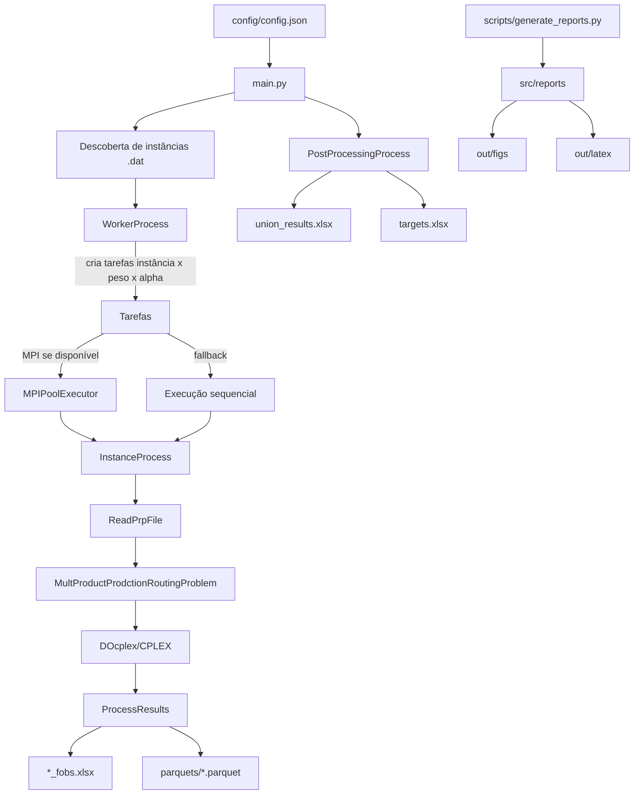
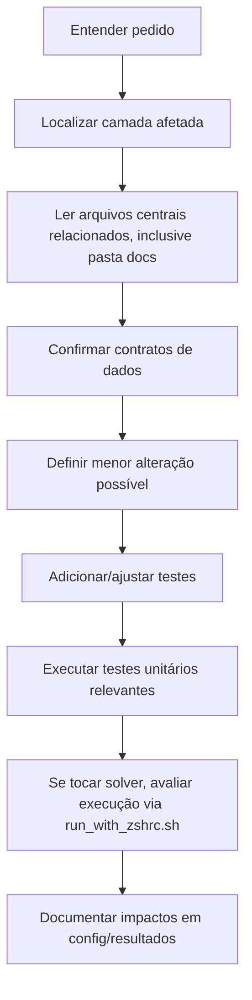
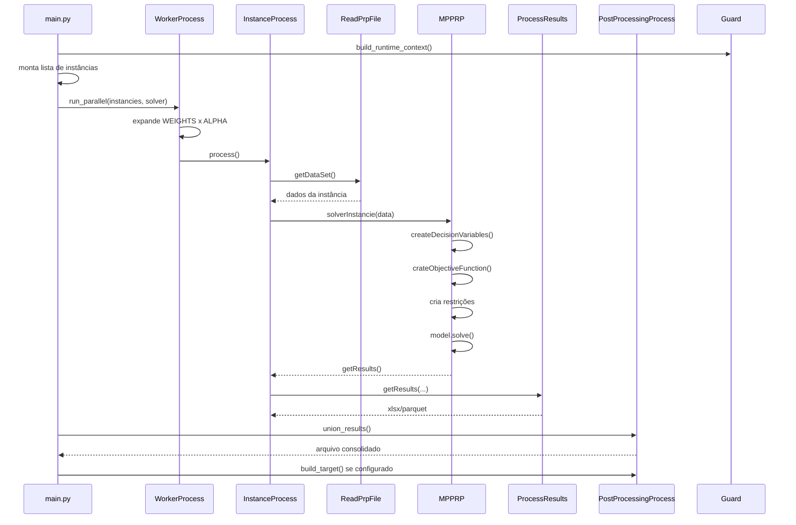

# AGENTS.md

Regra central: não invente comportamento. Ao modificar este projeto, confirme cada afirmação nos arquivos citados e preserve as convenções existentes, mesmo quando houver nomes com erros de digitação.

## Objetivo do projeto

O repositório implementa experimentos para o **Multi Product Production Routing Problem**, combinando produção, estoque e roteamento de veículos em um modelo de otimização. O sistema lê instâncias `.dat`, executa o solver para combinações de pesos e valores de `alpha`, grava resultados em Excel/Parquet, consolida saídas e gera relatórios.

| Evidência | Arquivos |
|---|---|
| Parser de instâncias `.dat` com clientes, produtos, veículos, períodos, custos, estoque, demanda e coordenadas | `src/helpers/ReadPrpFile.py` |
| Modelo DOcplex/CPLEX com variáveis de produção, estoque, entrega e rota | `src/solvers/MultProductProdctionRoutingProblem.py` |
| Execução por instância, peso e alpha | `src/process/WorkerProcess.py`, `constants.py` |
| Persistência de resultados em `.xlsx` e `.parquet` | `src/process/ProcessResults.py` |
| Consolidação e criação de targets | `src/process/PostProcessingProcess.py` |
| Contexto original do problema PRP e classes de instâncias | `README.md`, `AGENTS.md` |

Não foi possível determinar a partir do código a formulação matemática acadêmica completa, a fonte externa das instâncias ou o significado científico de todos os cenários experimentais.

## Execução local

Para execuções no sandbox que realmente testem o código do projeto, carregar `~/.zshrc` antes de chamar Poetry. O runner recomendado para testes é `pytest`, inclusive para testes legados baseados em `unittest`, porque o `pytest` também os coleta.

```bash
source "$HOME/.zshrc" && poetry run pytest tests/test_...
```

Para executar um arquivo específico, use:

```bash
source "$HOME/.zshrc" && poetry run pytest tests/test_greedy_constructive_heuristic.py
```

Quando o objetivo for executar o fluxo completo do projeto, usar `./run_with_zshrc.sh` como ponto de entrada, porque ele já carrega `~/.zshrc` e chama o `python` do ambiente Poetry antes de entrar em `main.py`.

Para outras execuções no sandbox, como `git commit`, revisão de arquivos, leitura de status ou tarefas de manutenção que não executem o solver, não é necessário passar pelo wrapper `./run_with_zshrc.sh`.

O GitHub está configurado neste repositório por HTTPS nos remotes `origin` e `upstream`. Ao realizar operações Git com o GitHub, como `commit`, `push`, `pull` ou criação de branches, preserve o uso de HTTPS e não altere os remotes para SSH.

Para comandos Git que dependam de autenticação no GitHub, use o bash externo já autenticado, em vez da sessão de sandbox.

Observação do ambiente: durante a execução dos testes apareceu o aviso do `pyenv` (`pyenv: cannot rehash ...`), mas isso não impediu a suíte de rodar quando o comando foi executado via `poetry run`.

## Arquitetura



| Camada | Responsabilidade | Arquivos |
|---|---|---|
| Configuração | Carregar `config.json` com cache estático | `config/config.py`, `config/config.json` |
| Entrada principal | Montar run, logs, instâncias e pós-processamento | `main.py` |
| Orquestração | Expandir instâncias por pesos/alpha e executar em paralelo ou sequencial | `src/process/WorkerProcess.py` |
| Execução unitária | Ler uma instância, instanciar solver, resolver, extrair e salvar resultados | `src/process/InstanceProcess.py` |
| Modelo | Criar variáveis, objetivo, restrições, resolver e extrair solução | `src/solvers/MultProductProdctionRoutingProblem.py` |
| Heurística | Construir solução heurística e opcionalmente warm start | `src/solvers/MultProductProdctionRoutingProblemGreedyConstructiveHeuristic.py`, `src/solvers/GreedyRandomizedConstructionRoute.py`, `src/solvers/TwoOptOnRoute.py` |
| Resultados | Escrever métricas por período e variáveis detalhadas | `src/process/ProcessResults.py` |
| Pós-processamento | Unir planilhas e gerar targets | `src/process/PostProcessingProcess.py` |
| Relatórios | Gerar figuras Plotly e tabelas LaTeX | `scripts/generate_reports.py`, `src/reports/*.py` |

## Convenções de código

| Convenção observada | Como agir | Evidência |
|---|---|---|
| Configuração global via `Config.get_nested(...)` | Antes de passar novos parâmetros, verifique se o padrão do projeto é buscar em `config/config.json` | `config/config.py`, `main.py`, `WorkerProcess.py`, `MultProductProdctionRoutingProblem.py` |
| Logging por classe `Logger` própria | Use `log.debug` para diagnósticos, `log.info` para marcos de execução e `log.warning`/`log.error` para condições operacionais | `src/log/Logger.py` |
| Escrita de resultados tabulares com pandas | Preserve colunas existentes, hashes e formatos `.xlsx`/`.parquet` | `src/process/ProcessResults.py`, `src/process/PostProcessingProcess.py` |
| Testes com `pytest` e mocks | Ao adicionar testes, prefira estilo `pytest`; testes legados com `unittest` podem permanecer quando já houver infraestrutura útil no arquivo | `tests/test_*.py`, `pyproject.toml` |
| Uso de constantes globais para pesos e alpha | Alterar pesos muda o espaço experimental inteiro | `constants.py`, `src/process/WorkerProcess.py` |

Não foi possível determinar a partir do código um padrão formal obrigatório de formatação além de `.pre-commit-config.yaml`, porque o conteúdo empacotado não foi suficiente para inferir política completa de estilo.

## Convenções de nomenclatura

Preserve nomes existentes, inclusive erros de grafia, para evitar quebrar imports e chamadas internas.

| Nome existente | Significado no código | Arquivos |
|---|---|---|
| `MultProductProdctionRoutingProblem` | Solver principal DOcplex/CPLEX | `src/solvers/MultProductProdctionRoutingProblem.py` |
| `MultProductProdctionRoutingProblemGreedyConstructiveHeuristic` | Heurística construtiva | `src/solvers/MultProductProdctionRoutingProblemGreedyConstructiveHeuristic.py` |
| `Instancie`, `instancie`, `instancies` | Instância/problema a processar | `main.py`, `src/process/WorkerProcess.py`, `src/process/InstanceProcess.py` |
| `crateObjectiveFunction` | Criação da função objetivo | `src/solvers/MultProductProdctionRoutingProblem.py` |
| `generteRelax` | Geração de relaxação linear | `src/solvers/MultProductProdctionRoutingProblem.py` |
| `FO`, `GAP`, `TIME`, `EPSILON` | Métricas de solver e objetivo | `src/process/InstanceProcess.py`, `src/process/ProcessResults.py` |
| `f1`..`f5` | Componentes da função objetivo | `src/solvers/MultProductProdctionRoutingProblem.py`, `src/process/ProcessResults.py` |

## Fluxo esperado para adicionar funcionalidades



Checklist operacional:

| Passo | Pergunta | Arquivos prováveis |
|---|---|---|
| 1 | A funcionalidade muda configuração? | `config/config.json`, `config/config.py` |
| 2 | Muda expansão de tarefas? | `constants.py`, `src/process/WorkerProcess.py` |
| 3 | Muda leitura de dados? | `src/helpers/ReadPrpFile.py`, `src/helpers/TargetsLoader.py` |
| 4 | Muda formulação matemática? | `src/solvers/MultProductProdctionRoutingProblem.py` |
| 5 | Muda formato de saída? | `src/process/ProcessResults.py`, `src/process/PostProcessingProcess.py`, `src/reports/utils.py` |
| 6 | Muda execução longa/HPC? | `src/process/WorkerProcess.py`, `script_*.sh` |
| 7 | Muda relatórios? | `src/reports/*.py`, `scripts/generate_reports.py`, `constants.py` |

## Fluxo esperado para corrigir bugs

1. Reproduza o bug com a menor entrada possível.
2. Identifique se o erro acontece em leitura, montagem de tarefas, solver, serialização, pós-processamento ou relatório.
3. Use os logs existentes antes de adicionar novos mecanismos.
4. Preserve o formato de saída salvo, salvo se o bug for justamente no contrato de saída.
5. Adicione teste que falhe antes da correção quando isso for possível sem CPLEX/MPI real.
6. Se o bug envolver MPI, use os testes do executor e mocks como guia; execução MPI local pode não ser possível conforme `AGENTS.md` original.

## Arquivos que nunca devem ser alterados sem análise

| Arquivo | Por que exige análise | O que verificar antes |
|---|---|---|
| `src/solvers/MultProductProdctionRoutingProblem.py` | Contém a formulação principal, variáveis, objetivo e restrições | Impacto matemático, CPLEX, resultados, testes |
| `src/process/ProcessResults.py` | Define contrato de saída Excel/Parquet e nomes de colunas usados por relatórios | Compatibilidade com `PostProcessingProcess` e `src/reports` |
| `constants.py` | Define pesos, alpha e arquivo base de relatórios | Impacto em todas as combinações experimentais |
| `config/config.json` | Controla solver, workers, diretórios e multiobjetivo | Execução local, HPC, targets |
| `src/process/WorkerProcess.py` | Controla paralelismo, MPI e seleção de pesos | Execução sequencial/MPI |
| `main.py` | Orquestra execução completa e filtro de instâncias | Descoberta de arquivos, logs, pós-processamento |
| `src/helpers/ReadPrpFile.py` | Parser do formato `.dat` | Compatibilidade com instâncias existentes |
| `src/process/PostProcessingProcess.py` | Consolida resultados e gera targets | Esquema de colunas e `targets.xlsx` |
| `script_*.sh` | Scripts de produção/HPC | Filas, módulos, ambiente virtual, MPI |

## Arquivos centrais do projeto

| Prioridade | Arquivo | Papel |
|---:|---|---|
| 1 | `main.py` | Entrada principal |
| 2 | `config/config.json` | Configuração de execução |
| 3 | `constants.py` | Pesos, alpha e arquivo de relatório |
| 4 | `src/process/WorkerProcess.py` | Orquestração de tarefas |
| 5 | `src/process/InstanceProcess.py` | Pipeline de uma instância |
| 6 | `src/solvers/MultProductProdctionRoutingProblem.py` | Modelo de otimização |
| 7 | `src/process/ProcessResults.py` | Persistência de resultados |
| 8 | `src/process/PostProcessingProcess.py` | União e targets |
| 9 | `src/helpers/ReadPrpFile.py` | Parser de instâncias |

## Fluxo de execução



Evidência: `main.py`, `src/process/WorkerProcess.py`, `src/process/InstanceProcess.py`, `src/helpers/ReadPrpFile.py`, `src/solvers/MultProductProdctionRoutingProblem.py`, `src/process/ProcessResults.py`, `src/process/PostProcessingProcess.py`.

## Responsabilidades de cada diretório

| Diretório | Responsabilidade | Observações |
|---|---|---|
| `config/` | Configuração JSON e classe `Config` | `config.json` é lido uma vez e cacheado |
| `scripts/` | Runners auxiliares | `generate_reports.py` roda relatórios |
| `src/helpers/` | Utilitários compartilhados | Parser, metadata, targets e gráficos |
| `src/log/` | Logger próprio | Grava arquivo e stdout conforme `logging.level` |
| `src/process/` | Orquestração e persistência | Worker, instância, pós-processamento, resultados |
| `src/reports/` | Relatórios científicos/analíticos | Lê Excel consolidado em `out/<constants.FILE>` |
| `src/solvers/` | Formulação e heurísticas | DOcplex/CPLEX e heurísticas de rota |
| `tests/` | Testes unitários | Use `pytest` como runner padrão. Testes legados podem usar classes `unittest`, desde que continuem coletáveis pelo `pytest`; inclui mocks e stubs |
| raiz | Entradas, constantes, scripts PBS e metadados | `main.py`, `constants.py`, `pyproject.toml`, `script_*.sh` |

## Classes principais

| Classe | Responsabilidade | Arquivo |
|---|---|---|
| `Config` | Carregar e consultar `config.json` | `config/config.py` |
| `Logger` | Logging filtrado em arquivo/stdout (`INFO`, `DEBUG`, `OFF`) | `src/log/Logger.py` |
| `ReadPrpFile` | Ler instâncias `.dat` | `src/helpers/ReadPrpFile.py` |
| `WorkerProcess` | Orquestrar tarefas | `src/process/WorkerProcess.py` |
| `InstanceProcess` | Processar uma instância | `src/process/InstanceProcess.py` |
| `PostProcessingProcess` | Unir resultados e criar targets | `src/process/PostProcessingProcess.py` |
| `MultProductProdctionRoutingProblem` | Modelo principal | `src/solvers/MultProductProdctionRoutingProblem.py` |
| `MultProductProdctionRoutingProblemGreedyConstructiveHeuristic` | Heurística construtiva/warm start | `src/solvers/MultProductProdctionRoutingProblemGreedyConstructiveHeuristic.py` |
| `GreedyRandomizedConstructionRoute` | Construção greedy randomizada de rotas | `src/solvers/GreedyRandomizedConstructionRoute.py` |
| `TwoOptOnRoute` | Melhoria 2-opt | `src/solvers/TwoOptOnRoute.py` |

## Funções principais

| Função | Papel | Arquivo |
|---|---|---|
| `_get_git_commit_hash6()` | Obter hash curto para `run_tag` | `main.py` |
| `_build_run_tag(now)` | Criar identificador da execução | `main.py` |
| `WorkerProcess.run_parallel()` | Criar e executar tarefas | `src/process/WorkerProcess.py` |
| `process(...)` | Função submetida ao executor/fallback | `src/process/WorkerProcess.py` |
| `InstanceProcess.process()` | Pipeline de uma instância | `src/process/InstanceProcess.py` |
| `InstanceProcess.solverInstancie()` | Selecionar solver por string | `src/process/InstanceProcess.py` |
| `ReadPrpFile.read()` | Parsear arquivo `.dat` | `src/helpers/ReadPrpFile.py` |
| `load_targets_by_file()` | Ler `targets.xlsx` | `src/helpers/TargetsLoader.py` |
| `normalize_instance_file_key()` | Normalizar chave de arquivo para targets | `src/helpers/TargetsLoader.py` |
| `MultProductProdctionRoutingProblem.solver()` | Montar e resolver modelo | `src/solvers/MultProductProdctionRoutingProblem.py` |
| `MultProductProdctionRoutingProblem.getResults()` | Extrair variáveis e métricas | `src/solvers/MultProductProdctionRoutingProblem.py` |
| `getResults(...)` | Gravar resultados | `src/process/ProcessResults.py` |
| `PostProcessingProcess.union_results()` | Consolidar Excel | `src/process/PostProcessingProcess.py` |
| `PostProcessingProcess.build_target()` | Gerar `targets.xlsx` | `src/process/PostProcessingProcess.py` |
| `generate_*` | Gerar relatórios | `src/reports/*.py`, `scripts/generate_reports.py` |

## Checklist antes de criar código novo

- A mudança é suportada por evidência do código ou por pedido explícito do usuário?
- Existe uma função/classe próxima que deve ser estendida em vez de criar uma nova?
- A nova lógica afeta colunas de Excel/Parquet?
- A nova lógica afeta `targets.xlsx`?
- A nova lógica precisa funcionar em MPI e sequencial?
- Há teste unitário existente que pode ser expandido?
- A execução com solver exige ambiente CPLEX? Se sim, considere teste unitário com mock.
- O nome novo segue o vocabulário existente sem quebrar imports?
- Gere os devidos testes unitários e de integração.
- Atualize o arquivo @docs/mathematical-mode.md, quando atualizar a formulação matemática.

## Checklist antes de remover código

- O código é referenciado por imports, chamadas dinâmicas ou scripts?
- Algum relatório depende de colunas produzidas por esse código?
- Algum teste mocka esse símbolo?
- Algum script HPC depende do comportamento?
- O código é parte do fluxo `build_target`?
- O código é parte do fluxo multiobjetivo?
- A remoção altera hashes, nomes de arquivos ou diretórios?
- A remoção afeta logs de execução longa?
- Foi feita busca global com `rg`?
- Foi documentado por que a remoção é segura?
- Atualize o arquivo @docs/mathematical-mode.md, quando atualizar a formulação matemática.

## Checklist antes de refatorar

- Refatoração preserva nomes públicos usados em outros arquivos?
- Refatoração preserva colunas de saída?
- Refatoração preserva semântica de `WEIGHTS`, `ALPHA` e `build_target`?
- Refatoração preserva comportamento sequencial e MPI?
- Refatoração preserva cleanup de modelo (`terminate`, `model.end`, `gc.collect`)?
- Refatoração preserva logs necessários para execução longa?
- Há testes antes/depois?
- Se tocar solver, há validação com instância pequena?
- Se tocar relatórios, há validação com arquivo Excel esperado?
- Se tocar config, há defaults para chaves ausentes?
- Atualize os devidos testes unitários e de integração.
- Atualize o arquivo @docs/mathematical-mode.md, quando atualizar a formulação matemática.

## Boas práticas específicas deste projeto

| Prática | Justificativa | Evidência |
|---|---|---|
| Use `./run_with_zshrc.sh` para testar execução real do solver localmente | Carrega `~/.zshrc` e ambiente CPLEX/Poetry segundo instrução existente | `AGENTS.md`, `run_with_zshrc.sh` |
| Prefira testes unitários com mocks para solver/MPI | CPLEX e MPI podem não estar disponíveis localmente | `tests/test_*.py`, `AGENTS.md` |
| Trate `mpi4py` como opcional no código | Import é condicional e há fallback sequencial | `src/process/WorkerProcess.py` |
| Mantenha compatibilidade de colunas | Relatórios dependem de `weight_hash`, `alpha`, `f1`..`f5`, `p1`..`p5`, targets e metadados | `src/process/ProcessResults.py`, `src/reports/utils.py`, `src/reports/*.py` |
| Ao mexer em nomes de instância, verifique regex | Metadados dependem do formato `PRP...` | `src/helpers/InstanceMetadata.py` |
| Ao mexer em targets, verifique normalização de caminhos | Matching depende de `normalize_instance_file_key` | `src/helpers/TargetsLoader.py` |

## Armadilhas encontradas

| Armadilha | Risco | Arquivos |
|---|---|---|
| `method` configurado como `"GUROBY"` mas solver usa DOcplex/CPLEX | IA pode procurar integração com Gurobi inexistente | `config/config.json`, `src/process/InstanceProcess.py`, `src/solvers/MultProductProdctionRoutingProblem.py` |
| `mpi4py` usado mas não declarado em `pyproject.toml` | Ambiente local pode falhar ou cair no fallback sequencial | `pyproject.toml`, `src/process/WorkerProcess.py` |
| Classe IV filtrada por `main.py` | Alterar filtro muda escopo experimental | `main.py`, `README.md` |
| `relaxed_solution.use` é consultado, mas não aparece no `config.json` empacotado | Default ausente pode alterar se `model.solve()` roda | `config/config.json`, `src/solvers/MultProductProdctionRoutingProblem.py` |
| `WEIGHTS` é escolhido no import de `WorkerProcess.py` | Mudar `postprocessing.build_target` em runtime depois do import pode não afetar `WEIGHTS` | `src/process/WorkerProcess.py` |
| Nomes com erros de digitação são usados como API interna | Renomear pode quebrar imports/chamadas | `src/solvers/*.py`, `src/process/*.py` |
| Relatórios leem `out/<constants.FILE>`, não necessariamente o último `union_results` | IA pode gerar relatório sobre arquivo errado | `constants.py`, `src/reports/utils.py` |
| `targets.xlsx` exige colunas específicas | Merge pode ser silenciosamente ignorado com warning | `src/process/PostProcessingProcess.py`, `src/helpers/TargetsLoader.py` |

## Decisões arquiteturais importantes

| Decisão observada | Impacto | Evidência |
|---|---|---|
| Pipeline centrado em `main.py` | Execução completa começa em um único script | `main.py` |
| Configuração JSON cacheada | Mudanças em `config.json` durante o processo podem não ser recarregadas | `config/config.py` |
| Execução por produto cartesiano de instâncias, pesos e `ALPHA` | Número de tarefas cresce rapidamente | `src/process/WorkerProcess.py`, `constants.py` |
| MPI opcional com fallback sequencial | Código deve funcionar sem `mpi4py` | `src/process/WorkerProcess.py` |
| Saídas por hash | Nomes de arquivos dependem de instância, peso e alpha | `src/process/ProcessResults.py` |
| Multiobjetivo por targets e desvios positivos | `targets` são parte do modelo quando `solver.multiobjective` está ativo | `src/solvers/MultProductProdctionRoutingProblem.py`, `src/helpers/TargetsLoader.py` |
| `build_target` incompatível com `multiobjective` na entrada principal | `main.py` lança exceção quando ambos são verdadeiros | `main.py` |
| Relatórios separados do pipeline principal | São executados por script próprio | `scripts/generate_reports.py`, `src/reports/*.py` |

## Glossário técnico

| Termo | Significado neste repositório | Arquivos |
|---|---|---|
| PRP | Production Routing Problem; problema que combina produção e roteamento | `AGENTS.md`, `README.md` |
| `.dat` | Arquivo de instância lido pelo parser | `src/helpers/ReadPrpFile.py` |
| Planta/depósito | Nó `0` usado em rotas e estoque inicial | `src/solvers/MultProductProdctionRoutingProblem.py`, `src/process/ProcessResults.py` |
| Cliente | Nós `1..i-1` nas restrições e demandas | `src/helpers/ReadPrpFile.py`, `src/solvers/MultProductProdctionRoutingProblem.py` |
| Período | Índice temporal `t` usado em produção, estoque, entrega e rota | `src/solvers/MultProductProdctionRoutingProblem.py` |
| Produto | Índice `p` usado em produção, estoque, demanda e transporte | `src/solvers/MultProductProdctionRoutingProblem.py` |
| Veículo | Índice `v` usado em rotas e entregas | `src/solvers/MultProductProdctionRoutingProblem.py` |
| `X` | Quantidade produzida do produto por período | `src/solvers/MultProductProdctionRoutingProblem.py` |
| `Y` | Variável binária de setup/produção | `src/solvers/MultProductProdctionRoutingProblem.py` |
| `I` | Estoque por produto, local e período | `src/solvers/MultProductProdctionRoutingProblem.py` |
| `Z` | Arco de rota usado por veículo | `src/solvers/MultProductProdctionRoutingProblem.py` |
| `R` | Quantidade transportada em arco por produto/veículo | `src/solvers/MultProductProdctionRoutingProblem.py` |
| `Q` | Quantidade entregue por produto/veículo/cliente/período | `src/solvers/MultProductProdctionRoutingProblem.py` |
| `f1` | Custo de produção | `src/solvers/MultProductProdctionRoutingProblem.py`, `src/process/ProcessResults.py` |
| `f2` | Custo de setup | `src/solvers/MultProductProdctionRoutingProblem.py`, `src/process/ProcessResults.py` |
| `f3` | Custo de estoque | `src/solvers/MultProductProdctionRoutingProblem.py`, `src/process/ProcessResults.py` |
| `f4` | Custo fixo de transporte | `src/solvers/MultProductProdctionRoutingProblem.py`, `src/process/ProcessResults.py` |
| `f5` | Custo variável de rota/transporte | `src/solvers/MultProductProdctionRoutingProblem.py`, `src/process/ProcessResults.py` |
| `FO` | Valor da função objetivo | `src/process/InstanceProcess.py`, `src/process/ProcessResults.py` |
| `GAP` | Gap relativo MIP reportado pelo solver | `src/solvers/MultProductProdctionRoutingProblem.py` |
| `ALPHA` | Valores globais `[0.01, 0.99]` para execução | `constants.py`, `src/process/WorkerProcess.py` |
| `WEIGHTS_OPTIMIZE` | Pesos usados na execução normal | `constants.py`, `src/process/WorkerProcess.py` |
| `WEIGHTS_TARGET` | Pesos unitários usados em `build_target` | `constants.py`, `src/process/WorkerProcess.py` |
| `targets.xlsx` | Planilha de metas por arquivo/período | `src/helpers/TargetsLoader.py`, `src/process/PostProcessingProcess.py` |

### Formulação matemática do problema

Disponível em docs/mathematical-model.md
