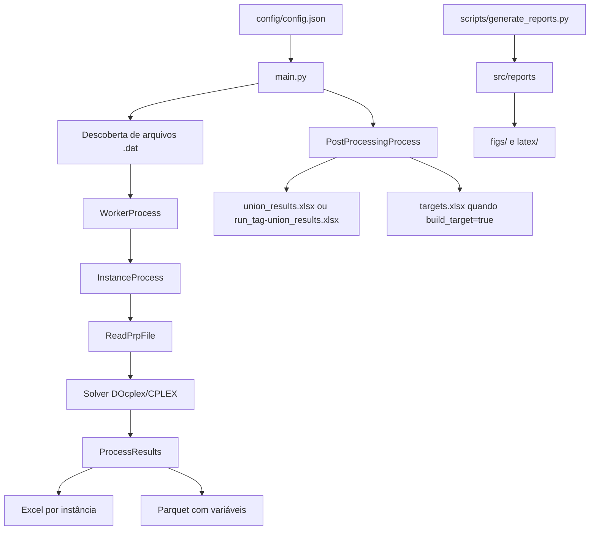
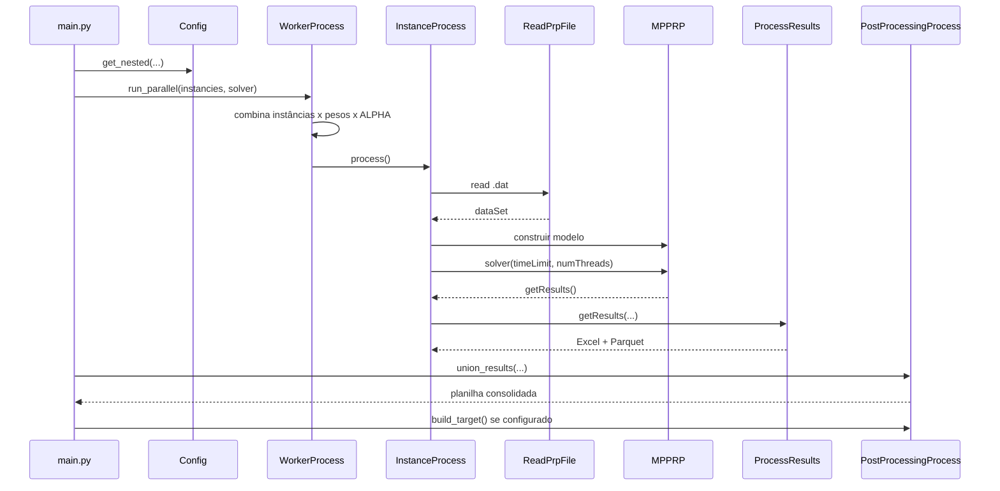

# Multi Product Production Routing Problem

## Objetivo do projeto

Este projeto executa experimentos computacionais para o problema **Multi Product Production Routing Problem**. A partir de arquivos de instância `.dat`, o sistema lê parâmetros de produção, estoque, demanda, veículos, custos e coordenadas, constrói um modelo de otimização em DOcplex/CPLEX, resolve combinações de pesos e valores de `alpha`, grava resultados por instância e depois consolida esses resultados em planilhas e relatórios.

O modelo considera, conforme as variáveis e funções objetivo encontradas no código:

- produção de múltiplos produtos por período;
- setup de produção;
- estoque na planta e nos clientes;
- entrega por veículos;
- roteamento de veículos entre depósito/planta e clientes;
- custos de produção, setup, estoque, custo fixo de transporte e custo variável de rota;
- modo multiobjetivo baseado em metas (`targets`) quando `solver.multiobjective` está habilitado.

As classes de instâncias documentadas no README original seguem a nomenclatura `PRP...` e são separadas por classes I a IV. O código filtra instâncias `PRP` com número maior ou igual a 31, portanto a Classe IV é ignorada pela execução principal.

Não foi possível determinar a partir do código a formulação acadêmica completa pretendida, a origem exata dos arquivos `.dat` ou o conjunto completo de instâncias, porque os diretórios `data`, `out`, `commands` e `analysis` foram excluídos do pacote Repomix.

Referências cruzadas: `src/helpers/ReadPrpFile.py`, `src/solvers/MultProductProdctionRoutingProblem.py`, `src/process/WorkerProcess.py`, `src/process/ProcessResults.py`, `src/process/PostProcessingProcess.py`, `main.py`, `README.md`, `config/config.json`, `constants.py`.

## Arquitetura resumida

O sistema é organizado como um pipeline em Python:



Módulos existentes:

- `config`: carrega `config/config.json` e expõe acesso simples por chave.
- `main.py`: ponto de entrada principal; monta a lista de instâncias, cria logs, chama execução paralela e pós-processamento.
- `src/process`: contém a orquestração de workers, execução de uma instância, escrita de resultados, união de planilhas e tabelas.
- `src/solvers`: contém o modelo matemático principal em DOcplex/CPLEX e uma heurística construtiva com 2-opt para rotas.
- `src/helpers`: contém leitura de instâncias, conversões de rota, gráficos, metadados, carregamento de targets e união auxiliar de saídas.
- `src/log`: logging simples em arquivo e stdout.
- `src/reports`: gera figuras e tabelas LaTeX a partir de resultados consolidados.
- `scripts`: contém o runner `generate_reports.py`.
- `tests`: contém testes unitários para execução MPI, fallback sequencial e geração de resultados.

Referências cruzadas: `config/config.py`, `main.py`, `src/process/WorkerProcess.py`, `src/process/InstanceProcess.py`, `src/process/ProcessResults.py`, `src/process/PostProcessingProcess.py`, `src/solvers/MultProductProdctionRoutingProblem.py`, `src/solvers/MultProductProdctionRoutingProblemGreedyConstructiveHeuristic.py`, `src/reports/__init__.py`, `scripts/generate_reports.py`, `tests/test_worker_process_mpi.py`, `tests/test_process_results.py`.

## Tecnologias utilizadas

Linguagem e empacotamento:

- Python, com requisito declarado `>=3.13,<3.14.1 || >3.14.1`.
- Poetry como backend de build, via `poetry-core`.

Bibliotecas declaradas:

- `docplex` e `cplex`: modelagem e resolução do modelo de otimização.
- `numpy`: vetores, matrizes e cálculos numéricos.
- `pandas`, `openpyxl` e `pyarrow`: leitura/escrita de Excel e Parquet.
- `matplotlib`: geração de gráficos de rotas/estoques.
- `plotly`, `kaleido`, `seaborn`, `nbformat`, `ipykernel`: geração/análise de relatórios e imagens.
- `networkx`, `jinja2`: dependências declaradas; não foi possível determinar a partir do código empacotado onde são usadas.

Bibliotecas opcionais ou condicionais:

- `mpi4py`: usado condicionalmente em `WorkerProcess.py` para `MPIPoolExecutor`. Não está listado em `pyproject.toml`.
- CPLEX precisa estar funcional para `docplex.mp.model.Model.solve()`.

Ferramentas e ambientes:

- PBS/HPC aparece nos scripts `script_memlong.sh`, `script_memshort.sh`, `script_paralela.sh`, `script_parexp.sh` e `script_testes.sh`.
- MPICH é carregado nesses scripts via `module load mpich/4.1.1-gcc-9.4.0`.
- `pre-commit` é configurado no arquivo `.pre-commit-config.yaml`.

Referências cruzadas: `pyproject.toml`, `src/solvers/MultProductProdctionRoutingProblem.py`, `src/process/WorkerProcess.py`, `src/process/ProcessResults.py`, `src/helpers/GraphDisplay.py`, `src/reports/performance_fob.py`, `src/reports/performance_weights.py`, `src/reports/gap_analysis.py`, `src/reports/sensitivity.py`, `.pre-commit-config.yaml`, `script_memlong.sh`, `script_memshort.sh`, `script_paralela.sh`, `script_parexp.sh`, `script_testes.sh`.

## Estrutura do projeto

```text
config/
  __init__.py
  config.json
  config.py
scripts/
  generate_reports.py
src/
  helpers/
  log/
  process/
  reports/
  solvers/
tests/
constants.py
main.py
pyproject.toml
run_with_zshrc.sh
script_*.sh
```

Diretórios e arquivos importantes:

- `config/`: configuração central. `Config` faz cache de `config.json` e oferece `get()` e `get_nested()`.
- `scripts/`: comandos auxiliares; `generate_reports.py` executa geração de relatórios por categoria.
- `src/helpers/`: utilitários de parsing, metadata, gráficos e targets.
- `src/log/`: logger próprio com escrita em arquivo e impressão em stdout.
- `src/process/`: pipeline de execução e persistência dos resultados.
- `src/reports/`: geração de tabelas LaTeX e figuras a partir de um arquivo Excel definido por `constants.FILE`.
- `src/solvers/`: modelo exato DOcplex/CPLEX e heurísticas de construção/rota.
- `tests/`: testes unitários com `unittest` e mocks/stubs para evitar dependências pesadas em alguns cenários.
- `constants.py`: define pesos de target, pesos de otimização, valores de `ALPHA` e nome de arquivo Excel usado por relatórios.
- `main.py`: entrada principal da execução.
- `run_with_zshrc.sh`: executa `main.py` com um Python específico, depois de carregar `~/.zshrc`.
- `script_*.sh`: scripts PBS para execução em filas HPC.

Não foi possível determinar a partir do código a estrutura real dos diretórios `data/` e `out/`, porque eles foram excluídos do pacote Repomix.

Referências cruzadas: seção `<directory_structure>` do `repomix-output.xml`, `config/config.py`, `config/config.json`, `scripts/generate_reports.py`, `constants.py`, `main.py`, `run_with_zshrc.sh`, `script_memlong.sh`, `script_memshort.sh`, `script_paralela.sh`, `script_parexp.sh`, `script_testes.sh`.

## Como executar

### Instalação

As dependências Python estão declaradas em `pyproject.toml`. Como o projeto usa `poetry-core` no build-system, uma instalação típica com Poetry seria:

```bash
poetry install
```

Não foi possível determinar a partir do código se existe um `poetry.lock`, ambiente Conda, Dockerfile ou outro procedimento oficial de instalação, porque esses arquivos não aparecem no pacote.

### Configuração

Edite `config/config.json`. Os blocos observados são:

- `solver`: `threadsLimit`, `timeLimit`, `method`, `multiobjective`.
- `workers`: `num`.
- `logging`: `level`, com valores `INFO` (padrão), `DEBUG` e `OFF`.
- `instance`: `dir`, `output`, `files`.
- `relaxed_solution`: `replace_model`; o código também consulta `relaxed_solution.use`, mas essa chave não aparece no `config.json` empacotado.
- `postprocessing`: `build_target`, `output`.

Exemplo observado:

```json
{
  "solver": {
    "threadsLimit": 1,
    "timeLimit": 3600,
    "method": "GUROBY",
    "multiobjective": true
  },
  "workers": {
    "num": "auto"
  },
  "instance": {
    "dir": "./data/",
    "output": "./out/",
    "files": ["DATA_PRP_5C", "DATA_PRP_10C", "DATA_PRP_20C", "DATA_PRP_30C"]
  }
}
```

Observação: apesar do nome `GUROBY`, o solver implementado usa DOcplex/CPLEX. Não há import de Gurobi no código empacotado.

### Execução local

```bash
python main.py
```

Também existe o wrapper:

```bash
./run_with_zshrc.sh
```

Esse wrapper carrega `~/.zshrc` e usa `PYTHON_BIN` se definido; caso contrário usa um caminho absoluto de virtualenv Poetry presente no script. Esse caminho é específico da máquina do autor e pode não existir em outro ambiente.

### Execução com MPI/HPC

Os scripts PBS executam:

```bash
mpirun python -m mpi4py.futures main.py
```

Eles também carregam `mpich/4.1.1-gcc-9.4.0`, ativam `phd3/bin/activate` e usam filas PBS como `memlong`, `memshort`, `paralela`, `parexp` e `testes`.

### Geração de relatórios

Para gerar relatórios:

```bash
python scripts/generate_reports.py --out-dir out
```

É possível limitar os relatórios:

```bash
python scripts/generate_reports.py --out-dir out --only fob weights gap sensitivity
```

Os relatórios leem `out/<FILE>`, onde `FILE` é definido em `constants.py` como `2026-04-19.xlsx`.

### GitHub Pages / Reports

Os relatórios HTML interativos são gerados diretamente em `docs/reports/<nome-do-relatorio>/index.html`; os PNG/SVG e as tabelas LaTeX continuam sendo gravados em `out/`. A página inicial fica em `docs/index.html` e usa caminhos relativos, funcionando também na URL de um GitHub Pages de projeto.

Para gerar os relatórios HTML a partir do Excel consolidado:

```bash
python scripts/generate_reports.py --out-dir out
```

Também é possível selecionar categorias: `python scripts/generate_reports.py --out-dir out --only fob weights`. Depois de revisar os arquivos em `docs/`, adicione-os, faça commit e push na branch `develop`; não há commit, push ou deploy automático. Para adicionar um novo relatório HTML, acrescente o gerador ao runner, grave seu `index.html` em um subdiretório de `docs/reports/` e inclua um cartão com link relativo em `docs/index.html`.

Para visualizar localmente, a partir da raiz do repositório, use um servidor HTTP simples (necessário para testar os mesmos caminhos relativos do Pages):

```bash
python -m http.server 8000 --directory docs
```

Abra `http://localhost:8000/`. No GitHub, configure manualmente `Settings → Pages → Build and deployment → Deploy from a branch → develop → /docs`.

### Testes

Os testes usam `unittest`. Uma forma compatível com a estrutura observada é:

```bash
python -m unittest discover tests
```

Não foi possível determinar a partir do código se há comando oficial de teste via Poetry, Makefile ou CI.

Referências cruzadas: `pyproject.toml`, `config/config.json`, `config/config.py`, `main.py`, `run_with_zshrc.sh`, `script_memlong.sh`, `script_memshort.sh`, `script_paralela.sh`, `script_parexp.sh`, `script_testes.sh`, `scripts/generate_reports.py`, `constants.py`, `tests/test_worker_process_mpi.py`, `tests/test_process_results.py`.

## Fluxo geral

1. `main.py` carrega configurações via `Config.get_nested()`.
2. `main.py` cria um `run_tag` com data, hash curto do commit Git e hash de timestamp.
3. `main.py` remove `output/logs` se existir e inicia `Logger`.
4. `main.py` expande `instance.files`: se o item contém `.dat`, trata como arquivo específico; caso contrário lista arquivos dentro de `instance.dir + pasta`.
5. Arquivos `PRP` com índice maior ou igual a 31 são ignorados.
6. Para cada arquivo restante, `main.py` cria diretório de saída por instância e monta a lista `instancies`.
7. `WorkerProcess.run_parallel()` expande cada instância para todas as combinações de pesos e `ALPHA`.
8. Se `mpi4py` estiver disponível, `WorkerProcess` usa um único `MPIPoolExecutor` para todas as tarefas; caso contrário executa sequencialmente.
10. Cada tarefa chama `InstanceProcess.process()`.
11. `InstanceProcess` lê a instância com `ReadPrpFile`, adiciona `weight`, `alpha` e `targets`, constrói o solver e chama `solver()`.
12. O solver cria variáveis, objetivo, restrições e resolve o modelo.
13. `InstanceProcess` extrai resultados com `getResults()` do solver.
14. `ProcessResults.getResults()` grava um Excel de objetivos por período e um Parquet detalhado com variáveis `Z`, `X`, `Y`, `I`, `R`, `Q`, `P`.
15. Depois da execução, `PostProcessingProcess.union_results()` consolida os `.xlsx` em uma planilha de união.
16. Se `postprocessing.build_target=true`, `PostProcessingProcess.build_target()` gera `targets.xlsx`.



Referências cruzadas: `main.py`, `src/process/WorkerProcess.py`, `src/process/InstanceProcess.py`, `src/helpers/ReadPrpFile.py`, `src/helpers/TargetsLoader.py`, `src/solvers/MultProductProdctionRoutingProblem.py`, `src/process/ProcessResults.py`, `src/process/PostProcessingProcess.py`, `constants.py`.

## Estrutura de módulos

### `config`

`config/config.py` define `Config`, uma classe estática com cache interno `_data`. O método `load()` lê `config/config.json` apenas uma vez. `get()` acessa uma chave de topo e `get_nested()` percorre chaves aninhadas.

Referências cruzadas: `config/__init__.py`, `config/config.py`, `config/config.json`.

### `src/helpers`

- `ReadPrpFile.py`: parser de arquivos `.dat`. Extrai número de clientes, produtos, veículos e períodos, além de parâmetros `B`, `b_p`, `c_p`, `s_p`, `M`, `U_pi`, `I_pi0`, `h_pi`, `C`, `f`, `a_ik`, `coordXY` e `d_pit`.
- `TargetsLoader.py`: normaliza caminhos de instância e carrega `targets.xlsx` por arquivo, exigindo coluna `file`.
- `InstanceMetadata.py`: extrai metadados do nome de arquivo com regex `PRP(\d+)_C(\d+)_P(\d+)_V(\d+)_T(\d+)_S(\d+)` e adiciona `instancia`, `clientes`, `produtos`, `veiculos`, `periodos`, `seeds` e `classe`.
- `Converter.py`: converte matriz de adjacência em rota e aplica transposição antes de converter em pontos de parada.

Referências cruzadas: `src/helpers/ReadPrpFile.py`, `src/helpers/TargetsLoader.py`, `src/helpers/InstanceMetadata.py`, `src/helpers/Converter.py`, `src/process/InstanceProcess.py`.

### `src/process`

- `WorkerProcess.py`: cria tarefas para cada instância, peso e alpha; carrega targets; usa um único executor MPI ou fallback sequencial.
- `InstanceProcess.py`: encapsula a execução de uma instância: leitura, criação do solver, solve, extração, escrita de resultados e cleanup.
- `ProcessResults.py`: transforma variáveis do solver em planilhas e registros Parquet. Calcula `f1` a `f5`, hashes, custos auxiliares e estruturas de rota por período.
- `PostProcessingProcess.py`: consolida `.xlsx`, adiciona metadados, mescla targets quando disponíveis e gera targets por ideal/nadir quando solicitado.

Referências cruzadas: `src/process/WorkerProcess.py`, `src/process/InstanceProcess.py`, `src/process/ProcessResults.py`, `src/process/PostProcessingProcess.py`, `main.py`.

### `src/solvers`

- `MultProductProdctionRoutingProblem.py`: solver principal com DOcplex/CPLEX. Define variáveis `X`, `Y`, `I`, `Z`, `R`, `Q`, variáveis de desvio `positive`, `negative` e `lambda_`; cria objetivo e restrições; resolve e extrai resultados.
- `MultProductProdctionRoutingProblemGreedyConstructiveHeuristic.py`: heurística construtiva que monta produção e rotas; opcionalmente usa sua solução como warm start para o solver principal quando `mitStart` é `True`.
- `GreedyRandomizedConstructionRoute.py`: construção randomized greedy de rotas com RCL e melhoria via 2-opt.
- `TwoOptOnRoute.py`: busca local 2-opt sobre uma rota.

Referências cruzadas: `src/solvers/MultProductProdctionRoutingProblem.py`, `src/solvers/MultProductProdctionRoutingProblemGreedyConstructiveHeuristic.py`, `src/solvers/GreedyRandomizedConstructionRoute.py`, `src/solvers/TwoOptOnRoute.py`, `src/process/InstanceProcess.py`.

### `src/reports`

Os relatórios partem de `read_results_df()`, que lê `out/<constants.FILE>`, remove pesos de target puros, cria labels de peso por `weight_hash`, calcula desvios relativos quando há colunas `p*` e `f*_target`, e calcula `f_sum_t`.

Geradores:

- `performance_fob.py`: perfil de desempenho por objetivos `desv_rel_targ_1` a `desv_rel_targ_5`.
- `performance_weights.py`: perfis de desempenho por pesos, tabelas de vencedores e mapeamento de pesos.
- `gap_analysis.py`: tabela LaTeX de gap médio por alpha, peso, clientes e classe, removendo outliers por IQR.
- `sensitivity.py`: tabelas LaTeX de sensibilidade `ct` por clientes e classe.

Referências cruzadas: `src/reports/utils.py`, `src/reports/performance_fob.py`, `src/reports/performance_weights.py`, `src/reports/gap_analysis.py`, `src/reports/sensitivity.py`, `src/reports/__init__.py`, `scripts/generate_reports.py`, `constants.py`.

## Convenções

Configuração:

- A configuração é centralizada em `config/config.json`.
- O código usa `Config.get_nested(...)` em vez de passar todos os parâmetros explicitamente.

Dados e nomes de instância:

- O parser espera arquivos `.dat` com seções textuais específicas, como `Number of Customers`, `B =`, `U_pi =`, `coordXY =` e `d_pit =`.
- Metadados são extraídos de nomes no formato `PRP{instancia}_C{clientes}_P{produtos}_V{veiculos}_T{periodos}_S{seed}`.
- A execução principal ignora arquivos `PRP` cuja instância seja `>=31`.

Pesos e alpha:

- `constants.WEIGHTS_OPTIMIZE` contém seis vetores de cinco pesos.
- `constants.WEIGHTS_TARGET` contém cinco vetores unitários.
- `constants.ALPHA` contém `[0.01, 0.99]`.
- `WorkerProcess` usa `WEIGHTS_TARGET` quando `postprocessing.build_target` é verdadeiro; caso contrário usa `WEIGHTS_OPTIMIZE`.

Saídas:

- Cada execução por instância/peso/alpha grava um Excel nomeado por hash com sufixo `_fobs.xlsx`.
- Variáveis detalhadas são gravadas em `parquets/<hash>_fobs.parquet`.
- A consolidação gera `<run_tag>-union_results.xlsx` ou `union_results.xlsx` no modo `build_target`.
- `targets.xlsx` é lido/escrito em `postprocessing.output`.

Logging:

- Logs ficam em `output/logs`.
- O logger imprime em stdout e grava em arquivo usando o mesmo nível configurado.
- `INFO` registra informações, avisos e erros; `DEBUG` inclui diagnósticos detalhados; `OFF` preserva apenas avisos e erros.

Estilo e nomenclatura:

- Há nomes com grafia inconsistente preservada no código, por exemplo `Prodction`, `Instancie`, `crateObjectiveFunction`, `creteInventoryBalancingInventoryCustomers` e `generteRelax`.
- Essa documentação não renomeia esses símbolos porque eles fazem parte da API interna existente.

Não foi possível determinar a partir do código uma convenção formal de lint/format além do arquivo `.pre-commit-config.yaml`, cujo conteúdo completo deve ser consultado antes de alterar padrões de estilo.

Referências cruzadas: `config/config.json`, `config/config.py`, `constants.py`, `main.py`, `src/helpers/ReadPrpFile.py`, `src/helpers/InstanceMetadata.py`, `src/process/WorkerProcess.py`, `src/process/ProcessResults.py`, `src/process/PostProcessingProcess.py`, `src/log/Logger.py`, `.pre-commit-config.yaml`.

## Pontos de entrada

Pontos de entrada executáveis observados:

- `main.py`: entrada principal para processamento de instâncias e pós-processamento.
- `scripts/generate_reports.py`: entrada para geração de relatórios.
- `run_with_zshrc.sh`: wrapper local para `main.py`.
- `script_memlong.sh`, `script_memshort.sh`, `script_paralela.sh`, `script_parexp.sh`, `script_testes.sh`: scripts PBS que executam `main.py` via MPI.
- Testes unitários executáveis diretamente por arquivo ou por descoberta do `unittest`: `tests/test_process_results.py`, `tests/test_worker_process_mpi.py`.

Pontos de entrada internos relevantes:

- `WorkerProcess.run_parallel()`: expande tarefas e executa com MPI ou sequencialmente.
- `process()` em `WorkerProcess.py`: função submetida ao executor MPI.
- `InstanceProcess.process()`: executa uma instância individual.
- `MultProductProdctionRoutingProblem.solver()`: monta e resolve o modelo principal.
- `PostProcessingProcess.union_results()` e `PostProcessingProcess.build_target()`: consolidam saídas e targets.

Referências cruzadas: `main.py`, `scripts/generate_reports.py`, `run_with_zshrc.sh`, `script_memlong.sh`, `script_memshort.sh`, `script_paralela.sh`, `script_parexp.sh`, `script_testes.sh`, `src/process/WorkerProcess.py`, `src/process/InstanceProcess.py`, `src/solvers/MultProductProdctionRoutingProblem.py`, `src/process/PostProcessingProcess.py`, `tests/test_process_results.py`, `tests/test_worker_process_mpi.py`.

## Dependências externas

### Solver de otimização

O modelo é construído com `docplex.mp.model.Model` e resolvido por `model.solve()`. A dependência `cplex` está declarada em `pyproject.toml`. Não há integração com Gurobi no código empacotado, apesar do valor de configuração `method: "GUROBY"` e do nome de branch de solver em `InstanceProcess.solverInstancie()`.

Referências cruzadas: `pyproject.toml`, `config/config.json`, `src/solvers/MultProductProdctionRoutingProblem.py`, `src/process/InstanceProcess.py`.

### MPI e ambiente HPC

`WorkerProcess.py` tenta importar `mpi4py` e `MPIPoolExecutor`. Se a importação falhar, define `MPI_BOOL=False` e executa as tarefas sequencialmente. Os scripts PBS usam `mpirun python -m mpi4py.futures main.py`; quando MPI está disponível, todas as tarefas são submetidas a um único executor.

Referências cruzadas: `src/process/WorkerProcess.py`, `script_memlong.sh`, `script_memshort.sh`, `script_paralela.sh`, `script_parexp.sh`, `script_testes.sh`.

### Sistema de arquivos

O pipeline depende de:

- diretório de instâncias em `config.instance.dir`;
- diretório de saída em `config.instance.output`;
- planilha `targets.xlsx` em `config.postprocessing.output` quando targets existem;
- arquivo `out/<constants.FILE>` para relatórios.

Não foi possível determinar a partir do código se esses caminhos são criados antes da execução em todos os ambientes; `main.py` cria diretórios por instância e `PostProcessingProcess.build_target()` cria o diretório de targets, mas o pacote não inclui dados reais.

Referências cruzadas: `config/config.json`, `main.py`, `src/helpers/TargetsLoader.py`, `src/process/PostProcessingProcess.py`, `src/reports/utils.py`, `constants.py`.

### Git

`main.py` chama `git rev-parse HEAD` para compor o `run_tag`. Se falhar, usa `000000`.

Referências cruzadas: `main.py`.

### Exportação de figuras

Relatórios usam Plotly/Kaleido para imagens. `performance_weights.py` implementa fallback com Chrome headless, buscando executáveis como `google-chrome`, `chromium`, `/Applications/Google Chrome.app/...` e Chrome for Testing em um caminho de macOS.

Referências cruzadas: `src/reports/performance_fob.py`, `src/reports/performance_weights.py`, `pyproject.toml`.

## Referências cruzadas

Esta documentação foi gerada exclusivamente a partir dos arquivos presentes em `repomix-output.xml`. As principais evidências por tema são:

- Objetivo e modelo: `src/solvers/MultProductProdctionRoutingProblem.py`, `src/helpers/ReadPrpFile.py`, `README.md`.
- Configuração: `config/config.json`, `config/config.py`.
- Execução principal: `main.py`.
- Paralelismo e MPI: `src/process/WorkerProcess.py`, scripts `script_*.sh`.
- Leitura de dados: `src/helpers/ReadPrpFile.py`.
- Targets: `src/helpers/TargetsLoader.py`, `src/process/PostProcessingProcess.py`.
- Resultados: `src/process/ProcessResults.py`, `src/process/PostProcessingProcess.py`.
- Heurísticas: `src/solvers/MultProductProdctionRoutingProblemGreedyConstructiveHeuristic.py`, `src/solvers/GreedyRandomizedConstructionRoute.py`, `src/solvers/TwoOptOnRoute.py`.
- Relatórios: `scripts/generate_reports.py`, `src/reports/*.py`, `constants.py`.
- Dependências: `pyproject.toml`.
- Testes: `tests/test_process_results.py`, `tests/test_worker_process_mpi.py`.
