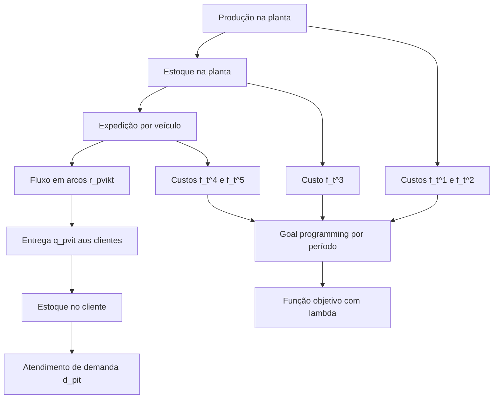
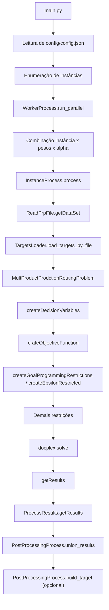

# Índice

- [1. Objetivo do Modelo](#1-objetivo-do-modelo)
- [2. Formulação Matemática](#2-formulação-matemática)
- [3. Conjuntos](#3-conjuntos)
- [5. Parâmetros](#5-parâmetros)
- [6. Variáveis de Decisão](#6-variáveis-de-decisão)
- [7. Função Objetivo](#7-função-objetivo)
- [8. Restrições](#8-restrições)
- [9. Fluxo do Modelo](#9-fluxo-do-modelo)
- [11. Correspondência Matemática ↔ Código](#11-correspondência-matemática--código)
- [15. Divergências Encontradas](#15-divergências-encontradas)
- [Checklist de Cobertura](#checklist-de-cobertura)

# 1. Objetivo do Modelo

## Problema resolvido

A formulação em LaTeX descreve um **Problema Integrado de Produção-Roteamento multiproduto e multiperíodo**. O modelo combina:

- dimensionamento de lotes na planta;
- gestão de estoques na planta e nos clientes;
- roteamento de veículos com capacidade limitada;
- atendimento de demanda por produto e por período.

Essa leitura vem do LaTeX e é consistente com o contexto descrito em `README.md` e com a classe `MultProductProdctionRoutingProblem` em `src/solvers/MultProductProdctionRoutingProblem.py`.

## Objetivo matemático

Pelo LaTeX, a função objetivo \eqref{eq:fo} minimiza uma combinação ponderada entre:

- um termo de penalização máxima, representado por `\lambda`;
- um termo agregado de desvios positivos normalizados por targets ajustados.

Operacionalmente, isso caracteriza uma formulação de **goal programming / epsilon-restrito normalizado** aplicada a cinco componentes de custo:

- setup de produção;
- produção;
- estoque;
- transporte fixo;
- transporte variável.

## Contexto de aplicação

Pelo `README.md`, o repositório trabalha com instâncias PRP organizadas em classes com diferentes perfis de custo:

- Classe I: instâncias padrão;
- Classe II: custo de produção elevado;
- Classe III: custo de transporte elevado;
- Classe IV: sem custo de estoque no cliente.

O `main.py` filtra a Classe IV e executa instâncias das pastas `DATA_PRP_5C`, `DATA_PRP_10C`, `DATA_PRP_20C` e `DATA_PRP_30C`.

## Hipóteses gerais

Obtidas do LaTeX:

- existe uma única planta indexada por `0`;
- clientes consomem demanda `d_{pit}` ao longo do horizonte;
- produção consome capacidade `B`;
- veículos têm capacidade `C`;
- cada cliente pode ser visitado no máximo uma vez por período;
- o fluxo de produto e o fluxo de veículos são usados para representar rotas e evitar subrotas.

Observadas na implementação:

- os conjuntos não são materializados como objetos; eles são implícitos por cardinalidades e laços `range(...)` em `src/solvers/MultProductProdctionRoutingProblem.py`;
- o modo experimental padrão está configurado como multiobjetivo em `config/config.json` (`"multiobjective": true`);
- pesos e valores de `alpha` são externos à instância e vêm de `constants.py`.

# 2. Formulação Matemática

## Visão geral

A formulação em LaTeX define:

- variáveis de produção `x_{pt}` e ativação `y_{pt}`;
- estoques `I_{pit}`;
- variáveis de roteamento binárias `z_{vikt}`;
- fluxos de produto por arco `r_{pvikt}`;
- entregas `q_{pvit}`;
- custos auxiliares por período `f_t^1, ..., f_t^5`;
- desvios positivos `p_t^j`, negativos `n_t^j` e penalização `\lambda`.

## Estrutura conceitual

## Leitura conjunta LaTeX + código

O núcleo matemático é implementado na classe `MultProductProdctionRoutingProblem` em `src/solvers/MultProductProdctionRoutingProblem.py`. A construção segue a ordem:

- criação das variáveis em `createDecisionVariables`;
- construção dos componentes de custo em `crateObjectiveFunction`;
- restrições de goal programming em `createGoalProgrammingRestrictions` e `createEpsilonRestricted`;
- restrições de balanço, capacidade e roteamento nos métodos `create...`.

Os dados da instância entram por `src/helpers/ReadPrpFile.py`. Os targets multiobjetivo entram por `src/helpers/TargetsLoader.py` e são associados à instância em `src/process/InstanceProcess.py`.

# 3. Conjuntos

Observação importante: no LaTeX os conjuntos aparecem simbolicamente; no código eles não são criados como estruturas nomeadas, mas sim como cardinalidades que dirigem laços `for`.

| Símbolo | Nome | Significado | Domínio matemático | Onde é criado no código | Onde é utilizado |
| --- | --- | --- | --- | --- | --- |
| `P` | Produtos | conjunto de itens | `p = 1, ..., P` | `src/helpers/ReadPrpFile.py` (`num_products`), copiado para `self.p` em `src/solvers/MultProductProdctionRoutingProblem.py` | todos os laços sobre produção, estoque, fluxo e entrega |
| `T` | Períodos | horizonte de planejamento | `t = 1, ..., T` | `src/helpers/ReadPrpFile.py` (`num_periods`), copiado para `self.t` | objetivo, estoques, capacidades, roteamento |
| `V` | Veículos | frota disponível | `v = 1, ..., V` | `src/helpers/ReadPrpFile.py` (`num_vehicles`), copiado para `self.v` | `Z`, `R`, `Q`, custos de transporte e restrições de rota |
| `N` | Clientes | conjunto de clientes sem a planta | `i = 1, ..., N` | `src/helpers/ReadPrpFile.py` (`num_customers`) | demanda `d_pit`; visitas; entregas; estoques de clientes |
| `K` | Nós | planta + clientes | `k = 0, ..., N` | inferido em `src/solvers/MultProductProdctionRoutingProblem.py` por `self.k = map["num_customers"] + 1` | arcos `Z` e `R`, conservação de fluxo |
| `I` | Locais / índice de nós | no LaTeX aparece tanto como clientes quanto como locais | ambíguo na formulação | inferido em `src/solvers/MultProductProdctionRoutingProblem.py` por `self.i = map["num_customers"] + 1` | estoques `I_{pit}`, balanços e custos de estoque |
| `J` | Componentes de objetivo | índice dos cinco custos auxiliares | `j = 1, ..., 5` | `self.j = 5` em `src/solvers/MultProductProdctionRoutingProblem.py` | desvios `positive`, `negative`, restrições de metas e de `lambda` |

## Observação sobre `I`, `N` e `K`

Há sobreposição de papéis na formulação:

- `N` representa clientes;
- `K` representa nós;
- `I` aparece em alguns pontos como clientes e em outros como locais.

No código, essa distinção é implementada da seguinte forma:

- `self.i = num_customers + 1`: índice de locais incluindo planta;
- `self.k = num_customers + 1`: índice de nós incluindo planta;
- clientes exclusivos são tratados por laços iniciando em `1`.

# 5. Parâmetros

| Parâmetro | Definição matemática | Interpretação | Origem dos dados | Como é calculado / carregado | Arquivos |
| --- | --- | --- | --- | --- | --- |
| `P` | número de produtos | cardinalidade do conjunto de itens | instância `.dat` | lido como `num_products` | `src/helpers/ReadPrpFile.py`, `src/solvers/MultProductProdctionRoutingProblem.py` |
| `T` | número de períodos | horizonte temporal | instância `.dat` | lido como `num_periods` | mesmos arquivos |
| `V` | número de veículos | tamanho da frota | instância `.dat` | lido como `num_vehicles` | mesmos arquivos |
| `K` | número de nós | planta + clientes | derivado | `num_customers + 1` | `src/solvers/MultProductProdctionRoutingProblem.py` |
| `N` | número de clientes | clientes sem a planta | instância `.dat` | lido como `num_customers` | `src/helpers/ReadPrpFile.py` |
| `B` | capacidade de produção | limite agregado de produção por período | instância `.dat` | lido na seção `B =` | `src/helpers/ReadPrpFile.py`, usado em `createPlantsMaximum` |
| `b_p` | tempo unitário de produção | consumo de capacidade por unidade produzida | instância `.dat` | lido na seção `b_p =` | `src/helpers/ReadPrpFile.py`, usado em `createPlantsMaximum` |
| `c_p` | custo unitário de produção | custo variável de produção | instância `.dat` | lido na seção `c_p =` | `src/helpers/ReadPrpFile.py`, usado em `crateObjectiveFunction` |
| `s_p` | custo de setup | custo fixo de ativar produção do item | instância `.dat` | lido na seção `s_p =` | `src/helpers/ReadPrpFile.py`, usado em `crateObjectiveFunction` |
| `M` | número grande | vinculação produção-setup | instância `.dat` | lido na seção `M =` | `src/helpers/ReadPrpFile.py`, usado em `createRelationshipBetweenProduction` |
| `U_{pi}` | capacidade de estoque | limite superior de estoque por item e local | instância `.dat` | lido na seção `U_pi =` | `src/helpers/ReadPrpFile.py`, usado em `createDelimitMaximumCapacityItemsAtPlant` |
| `I_{pi0}` | estoque inicial | estoque inicial na planta e clientes | instância `.dat` | lido na seção `I_pi0 =` | `src/helpers/ReadPrpFile.py`, usado nos balanços de estoque |
| `h_{pi}` | custo unitário de estoque | custo de manter item em estoque por local | instância `.dat` | lido na seção `h_pi =` | `src/helpers/ReadPrpFile.py`, usado em `crateObjectiveFunction` |
| `C` | capacidade do veículo | limite de carga por arco/veículo | instância `.dat` | lido na seção `C =` | `src/helpers/ReadPrpFile.py`, usado em `createVehicleLoadCapacityDelimited` |
| `f` | custo fixo de transporte | custo de ativar saída de veículo da planta | instância `.dat` | lido na seção `f =` | `src/helpers/ReadPrpFile.py`, usado em `crateObjectiveFunction` |
| `a_{ik}` | custo de transporte no arco | custo variável de deslocamento entre nós | instância `.dat` | lido na seção `a_ik =` | `src/helpers/ReadPrpFile.py`, usado em `crateObjectiveFunction` |
| `d_{pit}` | demanda | consumo do produto `p` no cliente `i` e período `t` | instância `.dat` | lido na seção `d_pit =` | `src/helpers/ReadPrpFile.py`, usado em `creteInventoryBalancingInventoryCustomers` |
| `\alpha` | peso da função objetivo | equilíbrio entre `\lambda` e desvios normalizados | experimento computacional | fornecido por `constants.py` (`ALPHA = [0.01, 0.99]`) e repassado por `WorkerProcess` | `constants.py`, `src/process/WorkerProcess.py`, `src/process/InstanceProcess.py`, `src/solvers/MultProductProdctionRoutingProblem.py` |
| `v_t^j` | peso do objetivo `j` no período `t` | ponderação dos desvios por componente | formulação LaTeX | no código aparece como vetor `weight[j]`, sem dependência temporal explícita | `constants.py`, `src/process/WorkerProcess.py`, `src/solvers/MultProductProdctionRoutingProblem.py` |
| `b_t^j` | target original | meta periódica para cada componente de custo | arquivo externo `targets.xlsx` | carregado por instância em `load_targets_by_file` | `src/helpers/TargetsLoader.py`, `src/process/InstanceProcess.py` |
| `\overline{b}_t^j` | target ajustado | target usado para evitar divisão por zero | calculado | ajustado em `_adjust_targets` | `src/solvers/MultProductProdctionRoutingProblem.py` |
| `WEIGHTS` | vetor de pesos experimentais | parametrização externa da priorização entre `f^1` a `f^5` | código | definido em `constants.py` e iterado em `run_parallel` | `constants.py`, `src/process/WorkerProcess.py` |

## Origem dos targets

Observado no código:

- `targets.xlsx` é carregado por `src/helpers/TargetsLoader.py`;
- os registros são indexados por arquivo de instância;
- `src/process/InstanceProcess.py` injeta a lista de targets em `data["targets"]`;
- `src/process/PostProcessingProcess.py` pode gerar `targets.xlsx` a partir de resultados anteriores via combinação ideal/nadir com fator `0.3`.

Isso não está presente na formulação LaTeX como processo computacional, apenas como parâmetros `b_t^j` e `\overline{b}_t^j`.

# 6. Variáveis de Decisão

| Variável | Domínio no LaTeX | Domínio observado no código | Significado | Arquivo onde é criada |
| --- | --- | --- | --- | --- |
| `x_{pt}` | `x_{pt} \ge 0` | inteira não negativa (`integer_var`) | quantidade produzida do item `p` no período `t` | `src/solvers/MultProductProdctionRoutingProblem.py`, `createDecisionVariables` |
| `y_{pt}` | binária | binária | ativa produção/setup do item `p` no período `t` | mesmo arquivo |
| `I_{pit}` | `I_{pit} \ge 0` | inteira não negativa (`integer_var`) | estoque do item `p` no local `i` ao final do período `t` | mesmo arquivo |
| `z_{vikt}` | binária | binária | uso do arco `(i,k)` pelo veículo `v` no período `t` | mesmo arquivo |
| `r_{pvikt}` | `r_{pvikt} \ge 0` | inteira não negativa (`integer_var`) | fluxo do item `p` no arco `(i,k)` do veículo `v` no período `t` | mesmo arquivo |
| `q_{pvit}` | `q_{pvit} \ge 0` | inteira não negativa (`integer_var`) | quantidade entregue do item `p` pelo veículo `v` ao cliente/local `i` no período `t` | mesmo arquivo |
| `f_t^1` | auxiliar | expressão linear | custo auxiliar periódico | construído em `crateObjectiveFunction` |
| `f_t^2` | auxiliar | expressão linear | custo auxiliar periódico | construído em `crateObjectiveFunction` |
| `f_t^3` | auxiliar | expressão linear | custo auxiliar periódico | construído em `crateObjectiveFunction` |
| `f_t^4` | auxiliar | expressão linear | custo auxiliar periódico | construído em `crateObjectiveFunction` |
| `f_t^5` | auxiliar | expressão linear | custo auxiliar periódico | construído em `crateObjectiveFunction` |
| `n_t^j` | contínua implícita | contínua (`continuous_var_dict`) | desvio negativo do objetivo `j` no período `t` | `createDecisionVariables` |
| `p_t^j` | contínua implícita | contínua (`continuous_var_dict`) | desvio positivo do objetivo `j` no período `t` | `createDecisionVariables` |
| `\lambda` | contínua | contínua (`continuous_var`) | variável de penalização máxima | `createDecisionVariables` |

## Observação importante

No código, as variáveis `x`, `I`, `r` e `q` são modeladas como inteiras. No LaTeX fornecido, elas aparecem apenas com restrições de não negatividade, sem explicitação de integralidade.

# 7. Função Objetivo

## Objetivo matemático

Pelo LaTeX, a função objetivo \eqref{eq:fo} é:

`\min \alpha \lambda + (1-\alpha)\sum_t \sum_j \frac{v_t^j p_t^j}{\overline{b}_t^j}`

Interpretação:

- `\lambda` controla o pior desvio normalizado;
- `p_t^j` representa excesso positivo em relação à meta `b_t^j`;
- a normalização por `\overline{b}_t^j` evita distorções de escala entre componentes;
- `\alpha` regula o compromisso entre minimax e soma ponderada dos desvios.

## Componentes de custo auxiliares

Pelo LaTeX:

| Símbolo | Interpretação | Equação |
| --- | --- | --- |
| `f_t^1` | custo total de setup | \eqref{eq:custo_setup} |
| `f_t^2` | custo total de produção | \eqref{eq:custo_producao} |
| `f_t^3` | custo total de estoque | \eqref{eq:custo_estoque} |
| `f_t^4` | custo fixo de transporte | \eqref{eq:custo_fixo_transporte} |
| `f_t^5` | custo variável de transporte | \eqref{eq:custo_variavel_transporte} |

## Implementação observada

Em `src/solvers/MultProductProdctionRoutingProblem.py`, `crateObjectiveFunction` constrói:

- `self.f1`: `sum(c_p[p] * X_p_t[p,t])` por período;
- `self.f2`: `sum(s_p[p] * Y_p_t[p,t])` por período;
- `self.f3`: `sum(h_p_i[p][i] * I_p_i_t[p,i,t])` por período;
- `self.f4`: `sum(f * Z_v_i_k_t[v,0,k,t])` por período;
- `self.f5`: `sum(a_i_k[i][k] * Z_v_i_k_t[v,i,k,t])` por período com `i != k`.

Logo, no código:

- `f1 = custo de produção`;
- `f2 = custo de setup`;
- `f3 = custo de estoque`;
- `f4 = custo fixo de transporte`;
- `f5 = custo variável de transporte`.

Essa associação difere da nomeação da formulação LaTeX para `f^1_t` e `f^2_t`.

## Termos implementados

| Termo | Interpretação operacional | Implementação |
| --- | --- | --- |
| `self.f1` | custo de produção | `crateObjectiveFunction` em `src/solvers/MultProductProdctionRoutingProblem.py` |
| `self.f2` | custo de setup | mesmo método |
| `self.f3` | custo de estoque | mesmo método |
| `self.f4` | custo fixo de transporte | mesmo método |
| `self.f5` | custo variável de transporte | mesmo método |
| `self.positive[j,t]` | desvio positivo por meta | `createDecisionVariables`, `createGoalProgrammingRestrictions` |
| `self.lambda_` | penalização máxima | `createDecisionVariables`, `createEpsilonRestricted` |

## Múltiplos modos de objetivo observados

O código possui três caminhos:

| Modo | Condição | Implementação |
| --- | --- | --- |
| construção de targets | `postprocessing.build_target = true` | minimiza soma ponderada direta dos custos |
| multiobjetivo | `solver.multiobjective = true` | minimiza expressão com `lambda`, desvios positivos e targets |
| singleobjective | caso contrário | minimiza combinação simples dos cinco custos |

Arquivos:

- `config/config.json`
- `src/solvers/MultProductProdctionRoutingProblem.py`

Como `config/config.json` define `"multiobjective": true`, o caminho mais aderente ao LaTeX é o multiobjetivo.

# 8. Restrições

## Restrição 1: Definição de `f_t^1`

### Equação

LaTeX \eqref{eq:custo_setup}: `f_t^1 = \sum_p s_p y_{pt}`

### Interpretação

Calcula o custo total de setup no período.

### Arquivo onde é implementada

Como expressão em `crateObjectiveFunction` de `src/solvers/MultProductProdctionRoutingProblem.py`.

## Restrição 2: Definição de `f_t^2`

### Equação

LaTeX \eqref{eq:custo_producao}: `f_t^2 = \sum_p c_p x_{pt}`

### Interpretação

Calcula o custo total de produção no período.

### Arquivo onde é implementada

Como expressão em `crateObjectiveFunction` de `src/solvers/MultProductProdctionRoutingProblem.py`.

## Restrição 3: Definição de `f_t^3`

### Equação

LaTeX \eqref{eq:custo_estoque}: `f_t^3 = \sum_p \sum_i h_{pi} I_{pit}`

### Interpretação

Calcula o custo total de estoque no período.

### Arquivo onde é implementada

Como expressão em `crateObjectiveFunction` de `src/solvers/MultProductProdctionRoutingProblem.py`.

## Restrição 4: Definição de `f_t^4`

### Equação

LaTeX \eqref{eq:custo_fixo_transporte}: `f_t^4 = \sum_v \sum_k f z_{v0kt}`

### Interpretação

Calcula o custo fixo total de transporte associado ao uso do veículo saindo da planta.

### Arquivo onde é implementada

Como expressão em `crateObjectiveFunction` de `src/solvers/MultProductProdctionRoutingProblem.py`.

## Restrição 5: Definição de `f_t^5`

### Equação

LaTeX \eqref{eq:custo_variavel_transporte}: `f_t^5 = \sum_v \sum_k \sum_{i \ne k} a_{ik} z_{vikt}`

### Interpretação

Calcula o custo variável total de deslocamento no período.

### Arquivo onde é implementada

Como expressão em `crateObjectiveFunction` de `src/solvers/MultProductProdctionRoutingProblem.py`.

## Restrição 6: Limite superior por `\lambda`

### Equação

LaTeX \eqref{eq:limite_lambda}: `\frac{v_t^j p_t^j}{\overline{b}_t^j} \le \lambda \quad \forall j,t`

### Interpretação

Garante que `\lambda` majorize os desvios positivos normalizados.

### Arquivo onde é implementada

`createEpsilonRestricted` em `src/solvers/MultProductProdctionRoutingProblem.py`.

Observação: no código a forma é `weight[j] * positive[j,t] <= lambda * new_targets[t]["f*_target"]`.

## Restrição 7: Balanço dos desvios

### Equação

LaTeX \eqref{eq:balanco_desvio}: `f_t^j + n_t^j - p_t^j = b_t^j \quad \forall j,t`

### Interpretação

Relaciona o valor do componente de custo com o target e seus desvios positivos e negativos.

### Arquivo onde é implementada

`createGoalProgrammingRestrictions` em `src/solvers/MultProductProdctionRoutingProblem.py`.

## Restrição 8: Balanço de estoque na planta

### Equação

LaTeX \eqref{eq:balanco_estoque_planta}: `x_{pt} + I_{p0,t-1} - \sum_v \sum_i q_{pvit} = I_{p0t}`

### Interpretação

Produção mais estoque anterior menos entregas no período resulta no estoque final da planta.

### Arquivo onde é implementada

`createEstablishInvetoryBalanceAtPlant` em `src/solvers/MultProductProdctionRoutingProblem.py`.

## Restrição 9: Balanço de estoque no cliente

### Equação

LaTeX \eqref{eq:balanco_estoque_cliente}: `\sum_v q_{pvit} + I_{pi,t-1} - d_{pit} = I_{pit}`

### Interpretação

Entregas mais estoque anterior menos demanda definem o estoque final do cliente.

### Arquivo onde é implementada

`creteInventoryBalancingInventoryCustomers` em `src/solvers/MultProductProdctionRoutingProblem.py`.

## Restrição 10: Capacidade de produção

### Equação

LaTeX \eqref{eq:capacidade_producao}: `\sum_p b_p x_{pt} \le B`

### Interpretação

Limita o esforço total de produção em cada período.

### Arquivo onde é implementada

`createPlantsMaximum` em `src/solvers/MultProductProdctionRoutingProblem.py`.

## Restrição 11: Ativação de setup

### Equação

LaTeX \eqref{eq:setup_producao}: `x_{pt} \le M y_{pt}`

### Interpretação

Só permite produção positiva quando a variável binária de ativação está ligada.

### Arquivo onde é implementada

`createRelationshipBetweenProduction` em `src/solvers/MultProductProdctionRoutingProblem.py`.

## Restrição 12: Capacidade de estoque

### Equação

LaTeX \eqref{eq:capacidade_estoque}: `I_{pit} \le U_{pi}`

### Interpretação

Impõe limite superior de armazenamento por item e local.

### Arquivo onde é implementada

`createDelimitMaximumCapacityItemsAtPlant` em `src/solvers/MultProductProdctionRoutingProblem.py`.

## PL relaxado para bounds do PSO

O PSO utiliza um PL auxiliar de dimensionamento de lotes, implementado em
`src/solvers/LotSizingRelaxation.py`. Esse PL contém somente as variáveis
contínuas `X`, `I` e `Q`, com não negatividade, e as restrições 8, 9, 10 e 12.
As restrições de setup, roteamento e capacidade dos veículos não fazem parte
desse relaxamento.

Para cada produto e período, são resolvidos dois objetivos independentes:

- `min X[p,t]`, gerando `LB[p,t]`;
- `max X[p,t]`, gerando `UB[p,t]`.

Durante a decodificação da partícula, o gene de produção é transformado em:

`X[p,t] = LB[p,t] + sigmoid(gene) * (UB[p,t] - LB[p,t])`.

A construção heurística ainda reconcilia esses valores com as entregas e as
rotas factíveis do problema integrado. Opcionalmente, um PL adicional que
minimiza `sum(X[p,t])` fornece uma solução-base para a primeira partícula;
essa solução-base não é usada diretamente como solução roteada.

## Restrição 13: Conservação de fluxo de produto em cliente

### Equação

LaTeX \eqref{eq:conservacao_fluxo_produto}: `\sum_{i \ne k} r_{pvikt} - \sum_{l \ne k} r_{pvklt} = q_{pvkt}`

### Interpretação

O fluxo do produto que entra no nó `k` menos o que sai é igual à quantidade entregue naquele nó.

### Arquivo onde é implementada

`createVehiclePreventTransshipmentIntermediateNodes` em `src/solvers/MultProductProdctionRoutingProblem.py`.

## Restrição 14: Balanço de fluxo na planta / eliminação de subrotas

### Equação

LaTeX \eqref{eq:balanco_fluxo_planta}: `\sum_v \sum_k r_{pv0kt} - \sum_v \sum_i r_{pvi0t} = \sum_v \sum_l q_{pvlt}`

### Interpretação

Fecha o balanço global de fluxo do produto em relação à planta e contribui para impedir subrotas desconectadas.

### Arquivo onde é implementada

`createEliminationSubroutes` em `src/solvers/MultProductProdctionRoutingProblem.py`.

## Restrição 15: Capacidade do veículo

### Equação

LaTeX \eqref{eq:capacidade_veiculo}: `\sum_p r_{pvikt} \le C z_{vikt}`

### Interpretação

Vincula fluxo de carga no arco à ativação binária do arco e à capacidade do veículo.

### Arquivo onde é implementada

`createVehicleLoadCapacityDelimited` em `src/solvers/MultProductProdctionRoutingProblem.py`.

## Restrição 16: Uma rota por veículo por período

### Equação

LaTeX \eqref{eq:limite_uso_veiculo}: `\sum_k z_{v0kt} \le 1`

### Interpretação

Cada veículo pode sair da planta no máximo uma vez em cada período.

### Arquivo onde é implementada

`createImposeMostOneRouteEachVehicle` em `src/solvers/MultProductProdctionRoutingProblem.py`.

## Restrição 17: Conservação de fluxo de veículos

### Equação

LaTeX \eqref{eq:conservacao_fluxo_veiculo}: `\sum_{i \ne k} z_{vikt} - \sum_{l \ne k} z_{vklt} = 0`

### Interpretação

Garante continuidade da rota do veículo em cada nó.

### Arquivo onde é implementada

`createEnsureRoutesOnlyPlant` em `src/solvers/MultProductProdctionRoutingProblem.py`.

## Restrição 18: Visitação única

### Equação

LaTeX \eqref{eq:visitacao_unica}: `\sum_v \sum_{i \ne k} z_{vikt} \le 1`

### Interpretação

Cada cliente pode ser visitado no máximo uma vez por período.

### Arquivo onde é implementada

`createVehicleMostVisitCustomerEachPeriod` em `src/solvers/MultProductProdctionRoutingProblem.py`.

## Restrição 19: Não negatividade

### Equação

LaTeX \eqref{eq:nao_negatividade}: `x_{pt}, I_{pit}, r_{pvikt}, q_{pvit} \ge 0`

### Interpretação

Impõe viabilidade física às quantidades produzidas, estocadas, transportadas e entregues.

### Arquivo onde é implementada

Domínios das variáveis em `createDecisionVariables` de `src/solvers/MultProductProdctionRoutingProblem.py`.

## Restrição 20: Binárias

### Equação

LaTeX \eqref{eq:binarias}: `y_{pt}, z_{vikt} \in \{0,1\}`

### Interpretação

Modela decisões discretas de setup e uso de arco.

### Arquivo onde é implementada

Domínios das variáveis em `createDecisionVariables` de `src/solvers/MultProductProdctionRoutingProblem.py`.

## Ajuste de targets nulos

### Equação

O LaTeX descreve substituição de `b_t^j` por `\overline{b}_t^j` quando `b_t^j = 0`.

### Interpretação

Evita divisão por zero nas expressões normalizadas da função objetivo e da restrição de `\lambda`.

### Arquivo onde é implementada

`_adjust_targets` em `src/solvers/MultProductProdctionRoutingProblem.py`.

# 9. Fluxo do Modelo

## Ciclo completo

1. `main.py` lê a configuração geral em `config/config.json`.
2. `main.py` enumera as instâncias e cria a lista de tarefas.
3. `src/process/WorkerProcess.py` combina cada instância com cada vetor de pesos e cada valor de `alpha`.
4. `src/process/InstanceProcess.py` lê a instância via `src/helpers/ReadPrpFile.py`.
5. `src/process/InstanceProcess.py` associa targets da instância via `src/helpers/TargetsLoader.py`.
6. `src/solvers/MultProductProdctionRoutingProblem.py` constrói variáveis, objetivo e restrições.
7. O solver docplex/CPLEX resolve o modelo.
8. `getResults()` extrai `Z`, `X`, `Y`, `I`, `R`, `Q`, desvios e métricas.
9. `src/process/ProcessResults.py` reconstrói indicadores por período e exporta resultados.
10. `src/process/PostProcessingProcess.py` consolida resultados e, opcionalmente, constrói novos targets.

# 11. Correspondência Matemática ↔ Código

| Elemento Matemático | Classe | Método | Arquivo |
| --- | --- | --- | --- |
| `P, T, V, N` | `ReadPrpFile` | `read` | `src/helpers/ReadPrpFile.py` |
| `K = N + 1`, `I = N + 1` | `MultProductProdctionRoutingProblem` | `__init__` | `src/solvers/MultProductProdctionRoutingProblem.py` |
| `B, b_p, c_p, s_p, M, U_{pi}, I_{pi0}, h_{pi}, C, f, a_{ik}, d_{pit}` | `ReadPrpFile` | `read` | `src/helpers/ReadPrpFile.py` |
| `\alpha` | `WorkerProcess` / `InstanceProcess` | `run_parallel`, `process` | `src/process/WorkerProcess.py`, `src/process/InstanceProcess.py` |
| `v_t^j` / pesos | `WorkerProcess` | `run_parallel` | `src/process/WorkerProcess.py`, `constants.py` |
| `b_t^j` | `TargetsLoader` | `load_targets_by_file` | `src/helpers/TargetsLoader.py` |
| `\overline{b}_t^j` | `MultProductProdctionRoutingProblem` | `_adjust_targets` | `src/solvers/MultProductProdctionRoutingProblem.py` |
| `x_{pt}, y_{pt}, I_{pit}, z_{vikt}, r_{pvikt}, q_{pvit}, p_t^j, n_t^j, \lambda` | `MultProductProdctionRoutingProblem` | `createDecisionVariables` | `src/solvers/MultProductProdctionRoutingProblem.py` |
| objetivo multiobjetivo | `MultProductProdctionRoutingProblem` | `crateObjectiveFunction` | `src/solvers/MultProductProdctionRoutingProblem.py` |
| \eqref{eq:balanco_desvio} | `MultProductProdctionRoutingProblem` | `createGoalProgrammingRestrictions` | `src/solvers/MultProductProdctionRoutingProblem.py` |
| \eqref{eq:limite_lambda} | `MultProductProdctionRoutingProblem` | `createEpsilonRestricted` | `src/solvers/MultProductProdctionRoutingProblem.py` |
| \eqref{eq:balanco_estoque_planta} | `MultProductProdctionRoutingProblem` | `createEstablishInvetoryBalanceAtPlant` | `src/solvers/MultProductProdctionRoutingProblem.py` |
| \eqref{eq:balanco_estoque_cliente} | `MultProductProdctionRoutingProblem` | `creteInventoryBalancingInventoryCustomers` | `src/solvers/MultProductProdctionRoutingProblem.py` |
| \eqref{eq:capacidade_producao} | `MultProductProdctionRoutingProblem` | `createPlantsMaximum` | `src/solvers/MultProductProdctionRoutingProblem.py` |
| \eqref{eq:setup_producao} | `MultProductProdctionRoutingProblem` | `createRelationshipBetweenProduction` | `src/solvers/MultProductProdctionRoutingProblem.py` |
| \eqref{eq:capacidade_estoque} | `MultProductProdctionRoutingProblem` | `createDelimitMaximumCapacityItemsAtPlant` | `src/solvers/MultProductProdctionRoutingProblem.py` |
| \eqref{eq:conservacao_fluxo_produto} | `MultProductProdctionRoutingProblem` | `createVehiclePreventTransshipmentIntermediateNodes` | `src/solvers/MultProductProdctionRoutingProblem.py` |
| \eqref{eq:balanco_fluxo_planta} | `MultProductProdctionRoutingProblem` | `createEliminationSubroutes` | `src/solvers/MultProductProdctionRoutingProblem.py` |
| \eqref{eq:capacidade_veiculo} | `MultProductProdctionRoutingProblem` | `createVehicleLoadCapacityDelimited` | `src/solvers/MultProductProdctionRoutingProblem.py` |
| \eqref{eq:limite_uso_veiculo} | `MultProductProdctionRoutingProblem` | `createImposeMostOneRouteEachVehicle` | `src/solvers/MultProductProdctionRoutingProblem.py` |
| \eqref{eq:conservacao_fluxo_veiculo} | `MultProductProdctionRoutingProblem` | `createEnsureRoutesOnlyPlant` | `src/solvers/MultProductProdctionRoutingProblem.py` |
| \eqref{eq:visitacao_unica} | `MultProductProdctionRoutingProblem` | `createVehicleMostVisitCustomerEachPeriod` | `src/solvers/MultProductProdctionRoutingProblem.py` |
| extração de solução | `MultProductProdctionRoutingProblem` | `getResults` | `src/solvers/MultProductProdctionRoutingProblem.py` |
| recomputação de `f1` a `f5` pós-solução | módulo de processo | `getResults` | `src/process/ProcessResults.py` |

# 15. Divergências Encontradas

| Item | Formulação | Código | Observação |
| --- | --- | --- | --- |
| Nomeação de `f_t^1` e `f_t^2` | `f_t^1` = setup, `f_t^2` = produção | `self.f1` = produção, `self.f2` = setup | Divergência nominal relevante; o código preserva os dois componentes, mas com índices trocados. |
| Função objetivo multiobjetivo | `\alpha \lambda + (1-\alpha)\sum_{t,j} v_t^j p_t^j / \overline{b}_t^j` | em `crateObjectiveFunction`, `alpha * lambda_` é repetido cinco vezes por período, uma para cada componente | O código implementa um peso efetivo maior para `\lambda` do que o sugerido pelo LaTeX. |
| Peso `v_t^j` | peso indexado por `j` e `t` | `weight[j]`, sem índice temporal explícito | O código usa pesos constantes por componente, não pesos por período. |
| Domínio de `x, I, r, q` | apenas não negatividade explícita | `integer_var` | O código impõe integralidade nessas variáveis; a formulação fornecida não a explicita. |
| Targets ajustados | texto diz "média dos valores não nulos"; fórmula usa média no horizonte `\sum_t b_t^j / T` | `_adjust_targets` usa `np.mean(values_k)` sobre todos os valores disponíveis | O código coincide com a média simples dos valores presentes, mas não há filtro explícito de não nulos. |
| Conjunto `I` | usado como clientes em alguns pontos e como locais em outros | `self.i = num_customers + 1` incluindo planta | A implementação resolve a ambiguidade tratando `i` como conjunto de locais. |
| Objetivo singleobjective | não aparece no LaTeX fornecido | existe caminho alternativo `self.model.minimize(self.f1 + self.f2 + self.f3 + self.f4 + self.f5)` | O repositório contém um modo adicional não documentado na formulação oficial. |
| Geração de targets | LaTeX trata `b_t^j` como dado | código pode construir `targets.xlsx` via ideal/nadir com fator `0.3` | O processo de obtenção de metas é um artefato computacional adicional do repositório. |
| Filtragem de instâncias | LaTeX não menciona exclusão de classes | `main.py` descarta arquivos `PRP31+` e o `README.md` informa que a Classe IV é ignorada | Divergência de escopo experimental, não da formulação interna do MIP. |

# Checklist de Cobertura

| Elemento da formulação | Status | Evidência |
| --- | --- | --- |
| conjuntos `P, T, V, K, N, I` | mapeado | `src/helpers/ReadPrpFile.py`, `src/solvers/MultProductProdctionRoutingProblem.py` |
| parâmetros estruturais da instância | mapeado | `src/helpers/ReadPrpFile.py` |
| `\alpha` | mapeado | `constants.py`, `src/process/WorkerProcess.py` |
| `v_t^j` | mapeado com divergência | `constants.py`, seção de divergências |
| `b_t^j` | mapeado | `src/helpers/TargetsLoader.py` |
| `\overline{b}_t^j` | mapeado | `_adjust_targets` em `src/solvers/MultProductProdctionRoutingProblem.py` |
| variáveis `x, y, I, z, r, q` | mapeado | `createDecisionVariables` |
| auxiliares `f_t^1 ... f_t^5` | mapeado com divergência nominal | `crateObjectiveFunction`, seção de divergências |
| desvios `n_t^j, p_t^j` | mapeado | `createDecisionVariables`, `createGoalProgrammingRestrictions` |
| `\lambda` | mapeado | `createDecisionVariables`, `createEpsilonRestricted` |
| função objetivo | mapeado com divergência | `crateObjectiveFunction`, seção de divergências |
| restrições \eqref{eq:custo_setup} a \eqref{eq:binarias} | mapeado | seção 8 |
| mecanismo de ajuste para target zero | mapeado com ressalva textual | `_adjust_targets`, seção de divergências |

Conclusão da verificação: todos os elementos presentes na formulação matemática fornecida possuem correspondência explícita na implementação ou foram registrados como divergência/ressalva na Seção 15.
