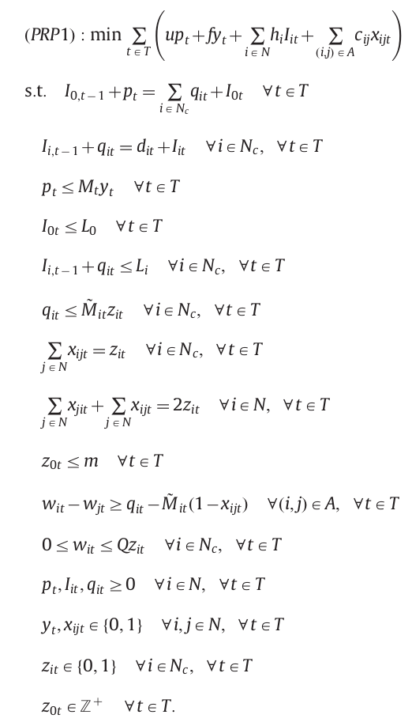

# Notation and formulations for the PRP

 - N -> represents the set of the plant and the customers indexed by i = {0; … ; n}
 - A = {(i,j): i,j ∈ N, i ≠ j} is the set of arcs
 - T = {1,...,l}
 - K = {1,...,m} 

### Parameters:
 - u -> unit production cost;
 - f -> fixed production setup cost;
 - hi -> unit inventory holding cost at node i;
 - cij -> transportation cost from node i to node j;
 - dit -> demand at customer i in period t;
 - C -> production capacity;
 - Q -> vehicle capacity;
 - Li -> maximum or target inventory level at node i; e
 - Ii0 -> initial inventory available at node i.

### Decision variables:

 - pt production quantity in period t;
 - Iit inventory at node i at the end of period t;
 - yt equal to 1 if there is production at the plant in period t, 0 otherwise;
 - z0t the number of vehicles leaving the plant in period t;
 - zit equal to 1 if customer i is visited in period t, 0 otherwise, ∀ i ∈ Nc;
 - xijt if a vehicle travels directly from node i to node j in period t, 0 otherwise;
 - qit quantity delivered to customer i in period t;
 - wit load of a vehicle before making a delivery to customer i in period t.

### Basic Formulation Based on that of Bard and Nananukul 
 